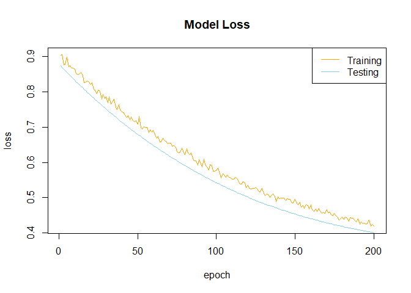
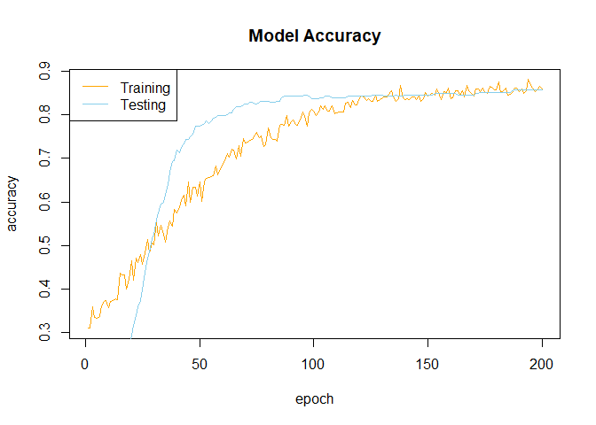

Project Notebook
================
Minghao Du

<style type="text/css">
@import url('https://fonts.googleapis.com/css2?family=Fira+Code:wght@300;400;500;600;700&display=swap');
code{
  font-family: 'Fira Code'!important;
}
</style>

    ## Loading required package: kableExtra

    ## Warning: package 'kableExtra' was built under R version 4.0.4

# Intro

# Set-up

Load packages.

``` r
rm(list = ls())
if (!require(readxl)) install.packages("readxl")
```

    ## Loading required package: readxl

``` r
library(readxl)
if (!require(tidyverse)) install.packages("tidyverse")
```

    ## Loading required package: tidyverse

    ## Warning: package 'tidyverse' was built under R version 4.0.5

    ## -- Attaching packages --------------------------------------- tidyverse 1.3.0 --

    ## v ggplot2 3.3.3     v purrr   0.3.4
    ## v tibble  3.0.5     v dplyr   1.0.3
    ## v tidyr   1.1.2     v stringr 1.4.0
    ## v readr   1.4.0     v forcats 0.5.1

    ## -- Conflicts ------------------------------------------ tidyverse_conflicts() --
    ## x tidyr::extract()    masks magrittr::extract()
    ## x dplyr::filter()     masks stats::filter()
    ## x dplyr::group_rows() masks kableExtra::group_rows()
    ## x dplyr::lag()        masks stats::lag()
    ## x purrr::set_names()  masks magrittr::set_names()

``` r
library(tidyverse)
if (!require(ggplot2)) install.packages("ggplot2")
library(ggplot2)

if (!require(e1071)) install.packages("e1071")
```

    ## Loading required package: e1071

    ## Warning: package 'e1071' was built under R version 4.0.4

``` r
library(e1071)
if (!require(fastDummies)) install.packages("fastDummies")
```

    ## Loading required package: fastDummies

    ## Warning: package 'fastDummies' was built under R version 4.0.5

``` r
library(fastDummies)
if (!require(caret)) install.packages("caret")
```

    ## Loading required package: caret

    ## Warning: package 'caret' was built under R version 4.0.4

    ## Loading required package: lattice

    ## 
    ## Attaching package: 'caret'

    ## The following object is masked from 'package:purrr':
    ## 
    ##     lift

``` r
library(caret)
# if (!require(GA)) install.packages("GA")
# library(GA)
```

# Import Data

``` r
raw_data <-
  read.csv(
    "../data/WA_Fn-UseC_-HR-Employee-Attrition.csv",
    stringsAsFactors = T,
    na.strings = '?'
  )

names(raw_data)[names(raw_data) == 'ï..Age'] <- 'Age'


glimpse(raw_data)
```

    ## Rows: 1,470
    ## Columns: 35
    ## $ Age                      <int> 41, 49, 37, 33, 27, 32, 59, 30, 38, 36, 35, 2~
    ## $ Attrition                <fct> Yes, No, Yes, No, No, No, No, No, No, No, No,~
    ## $ BusinessTravel           <fct> Travel_Rarely, Travel_Frequently, Travel_Rare~
    ## $ DailyRate                <int> 1102, 279, 1373, 1392, 591, 1005, 1324, 1358,~
    ## $ Department               <fct> Sales, Research & Development, Research & Dev~
    ## $ DistanceFromHome         <int> 1, 8, 2, 3, 2, 2, 3, 24, 23, 27, 16, 15, 26, ~
    ## $ Education                <int> 2, 1, 2, 4, 1, 2, 3, 1, 3, 3, 3, 2, 1, 2, 3, ~
    ## $ EducationField           <fct> Life Sciences, Life Sciences, Other, Life Sci~
    ## $ EmployeeCount            <int> 1, 1, 1, 1, 1, 1, 1, 1, 1, 1, 1, 1, 1, 1, 1, ~
    ## $ EmployeeNumber           <int> 1, 2, 4, 5, 7, 8, 10, 11, 12, 13, 14, 15, 16,~
    ## $ EnvironmentSatisfaction  <int> 2, 3, 4, 4, 1, 4, 3, 4, 4, 3, 1, 4, 1, 2, 3, ~
    ## $ Gender                   <fct> Female, Male, Male, Female, Male, Male, Femal~
    ## $ HourlyRate               <int> 94, 61, 92, 56, 40, 79, 81, 67, 44, 94, 84, 4~
    ## $ JobInvolvement           <int> 3, 2, 2, 3, 3, 3, 4, 3, 2, 3, 4, 2, 3, 3, 2, ~
    ## $ JobLevel                 <int> 2, 2, 1, 1, 1, 1, 1, 1, 3, 2, 1, 2, 1, 1, 1, ~
    ## $ JobRole                  <fct> Sales Executive, Research Scientist, Laborato~
    ## $ JobSatisfaction          <int> 4, 2, 3, 3, 2, 4, 1, 3, 3, 3, 2, 3, 3, 4, 3, ~
    ## $ MaritalStatus            <fct> Single, Married, Single, Married, Married, Si~
    ## $ MonthlyIncome            <int> 5993, 5130, 2090, 2909, 3468, 3068, 2670, 269~
    ## $ MonthlyRate              <int> 19479, 24907, 2396, 23159, 16632, 11864, 9964~
    ## $ NumCompaniesWorked       <int> 8, 1, 6, 1, 9, 0, 4, 1, 0, 6, 0, 0, 1, 0, 5, ~
    ## $ Over18                   <fct> Y, Y, Y, Y, Y, Y, Y, Y, Y, Y, Y, Y, Y, Y, Y, ~
    ## $ OverTime                 <fct> Yes, No, Yes, Yes, No, No, Yes, No, No, No, N~
    ## $ PercentSalaryHike        <int> 11, 23, 15, 11, 12, 13, 20, 22, 21, 13, 13, 1~
    ## $ PerformanceRating        <int> 3, 4, 3, 3, 3, 3, 4, 4, 4, 3, 3, 3, 3, 3, 3, ~
    ## $ RelationshipSatisfaction <int> 1, 4, 2, 3, 4, 3, 1, 2, 2, 2, 3, 4, 4, 3, 2, ~
    ## $ StandardHours            <int> 80, 80, 80, 80, 80, 80, 80, 80, 80, 80, 80, 8~
    ## $ StockOptionLevel         <int> 0, 1, 0, 0, 1, 0, 3, 1, 0, 2, 1, 0, 1, 1, 0, ~
    ## $ TotalWorkingYears        <int> 8, 10, 7, 8, 6, 8, 12, 1, 10, 17, 6, 10, 5, 3~
    ## $ TrainingTimesLastYear    <int> 0, 3, 3, 3, 3, 2, 3, 2, 2, 3, 5, 3, 1, 2, 4, ~
    ## $ WorkLifeBalance          <int> 1, 3, 3, 3, 3, 2, 2, 3, 3, 2, 3, 3, 2, 3, 3, ~
    ## $ YearsAtCompany           <int> 6, 10, 0, 8, 2, 7, 1, 1, 9, 7, 5, 9, 5, 2, 4,~
    ## $ YearsInCurrentRole       <int> 4, 7, 0, 7, 2, 7, 0, 0, 7, 7, 4, 5, 2, 2, 2, ~
    ## $ YearsSinceLastPromotion  <int> 0, 1, 0, 3, 2, 3, 0, 0, 1, 7, 0, 0, 4, 1, 0, ~
    ## $ YearsWithCurrManager     <int> 5, 7, 0, 0, 2, 6, 0, 0, 8, 7, 3, 8, 3, 2, 3, ~

# Preprocess the data

``` r
tmp_Attrition <- raw_data$Attrition

data_droped_col <- subset(raw_data, select = -c(Attrition, EmployeeCount, StandardHours, Over18))

data_dummied <- dummy_cols(data_droped_col)

data_processed <-
  data_dummied[, sapply(data_dummied, class) != "factor"]

colnames(data_processed) <- gsub(" ", "", colnames(data_processed))
colnames(data_processed) <- gsub("-", "", colnames(data_processed))
colnames(data_processed) <- gsub("&", "", colnames(data_processed))
colnames(data_processed) <- gsub("`", "", colnames(data_processed))

data_processed$Attrition <- tmp_Attrition

glimpse(data_processed)
```

    ## Rows: 1,470
    ## Columns: 53
    ## $ Age                              <int> 41, 49, 37, 33, 27, 32, 59, 30, 38, 3~
    ## $ DailyRate                        <int> 1102, 279, 1373, 1392, 591, 1005, 132~
    ## $ DistanceFromHome                 <int> 1, 8, 2, 3, 2, 2, 3, 24, 23, 27, 16, ~
    ## $ Education                        <int> 2, 1, 2, 4, 1, 2, 3, 1, 3, 3, 3, 2, 1~
    ## $ EmployeeNumber                   <int> 1, 2, 4, 5, 7, 8, 10, 11, 12, 13, 14,~
    ## $ EnvironmentSatisfaction          <int> 2, 3, 4, 4, 1, 4, 3, 4, 4, 3, 1, 4, 1~
    ## $ HourlyRate                       <int> 94, 61, 92, 56, 40, 79, 81, 67, 44, 9~
    ## $ JobInvolvement                   <int> 3, 2, 2, 3, 3, 3, 4, 3, 2, 3, 4, 2, 3~
    ## $ JobLevel                         <int> 2, 2, 1, 1, 1, 1, 1, 1, 3, 2, 1, 2, 1~
    ## $ JobSatisfaction                  <int> 4, 2, 3, 3, 2, 4, 1, 3, 3, 3, 2, 3, 3~
    ## $ MonthlyIncome                    <int> 5993, 5130, 2090, 2909, 3468, 3068, 2~
    ## $ MonthlyRate                      <int> 19479, 24907, 2396, 23159, 16632, 118~
    ## $ NumCompaniesWorked               <int> 8, 1, 6, 1, 9, 0, 4, 1, 0, 6, 0, 0, 1~
    ## $ PercentSalaryHike                <int> 11, 23, 15, 11, 12, 13, 20, 22, 21, 1~
    ## $ PerformanceRating                <int> 3, 4, 3, 3, 3, 3, 4, 4, 4, 3, 3, 3, 3~
    ## $ RelationshipSatisfaction         <int> 1, 4, 2, 3, 4, 3, 1, 2, 2, 2, 3, 4, 4~
    ## $ StockOptionLevel                 <int> 0, 1, 0, 0, 1, 0, 3, 1, 0, 2, 1, 0, 1~
    ## $ TotalWorkingYears                <int> 8, 10, 7, 8, 6, 8, 12, 1, 10, 17, 6, ~
    ## $ TrainingTimesLastYear            <int> 0, 3, 3, 3, 3, 2, 3, 2, 2, 3, 5, 3, 1~
    ## $ WorkLifeBalance                  <int> 1, 3, 3, 3, 3, 2, 2, 3, 3, 2, 3, 3, 2~
    ## $ YearsAtCompany                   <int> 6, 10, 0, 8, 2, 7, 1, 1, 9, 7, 5, 9, ~
    ## $ YearsInCurrentRole               <int> 4, 7, 0, 7, 2, 7, 0, 0, 7, 7, 4, 5, 2~
    ## $ YearsSinceLastPromotion          <int> 0, 1, 0, 3, 2, 3, 0, 0, 1, 7, 0, 0, 4~
    ## $ YearsWithCurrManager             <int> 5, 7, 0, 0, 2, 6, 0, 0, 8, 7, 3, 8, 3~
    ## $ BusinessTravel_NonTravel         <int> 0, 0, 0, 0, 0, 0, 0, 0, 0, 0, 0, 0, 0~
    ## $ BusinessTravel_Travel_Frequently <int> 0, 1, 0, 1, 0, 1, 0, 0, 1, 0, 0, 0, 0~
    ## $ BusinessTravel_Travel_Rarely     <int> 1, 0, 1, 0, 1, 0, 1, 1, 0, 1, 1, 1, 1~
    ## $ Department_HumanResources        <int> 0, 0, 0, 0, 0, 0, 0, 0, 0, 0, 0, 0, 0~
    ## $ Department_ResearchDevelopment   <int> 0, 1, 1, 1, 1, 1, 1, 1, 1, 1, 1, 1, 1~
    ## $ Department_Sales                 <int> 1, 0, 0, 0, 0, 0, 0, 0, 0, 0, 0, 0, 0~
    ## $ EducationField_HumanResources    <int> 0, 0, 0, 0, 0, 0, 0, 0, 0, 0, 0, 0, 0~
    ## $ EducationField_LifeSciences      <int> 1, 1, 0, 1, 0, 1, 0, 1, 1, 0, 0, 1, 1~
    ## $ EducationField_Marketing         <int> 0, 0, 0, 0, 0, 0, 0, 0, 0, 0, 0, 0, 0~
    ## $ EducationField_Medical           <int> 0, 0, 0, 0, 1, 0, 1, 0, 0, 1, 1, 0, 0~
    ## $ EducationField_Other             <int> 0, 0, 1, 0, 0, 0, 0, 0, 0, 0, 0, 0, 0~
    ## $ EducationField_TechnicalDegree   <int> 0, 0, 0, 0, 0, 0, 0, 0, 0, 0, 0, 0, 0~
    ## $ Gender_Female                    <int> 1, 0, 0, 1, 0, 0, 1, 0, 0, 0, 0, 1, 0~
    ## $ Gender_Male                      <int> 0, 1, 1, 0, 1, 1, 0, 1, 1, 1, 1, 0, 1~
    ## $ JobRole_HealthcareRepresentative <int> 0, 0, 0, 0, 0, 0, 0, 0, 0, 1, 0, 0, 0~
    ## $ JobRole_HumanResources           <int> 0, 0, 0, 0, 0, 0, 0, 0, 0, 0, 0, 0, 0~
    ## $ JobRole_LaboratoryTechnician     <int> 0, 0, 1, 0, 1, 1, 1, 1, 0, 0, 1, 1, 0~
    ## $ JobRole_Manager                  <int> 0, 0, 0, 0, 0, 0, 0, 0, 0, 0, 0, 0, 0~
    ## $ JobRole_ManufacturingDirector    <int> 0, 0, 0, 0, 0, 0, 0, 0, 1, 0, 0, 0, 0~
    ## $ JobRole_ResearchDirector         <int> 0, 0, 0, 0, 0, 0, 0, 0, 0, 0, 0, 0, 0~
    ## $ JobRole_ResearchScientist        <int> 0, 1, 0, 1, 0, 0, 0, 0, 0, 0, 0, 0, 1~
    ## $ JobRole_SalesExecutive           <int> 1, 0, 0, 0, 0, 0, 0, 0, 0, 0, 0, 0, 0~
    ## $ JobRole_SalesRepresentative      <int> 0, 0, 0, 0, 0, 0, 0, 0, 0, 0, 0, 0, 0~
    ## $ MaritalStatus_Divorced           <int> 0, 0, 0, 0, 0, 0, 0, 1, 0, 0, 0, 0, 1~
    ## $ MaritalStatus_Married            <int> 0, 1, 0, 1, 1, 0, 1, 0, 0, 1, 1, 0, 0~
    ## $ MaritalStatus_Single             <int> 1, 0, 1, 0, 0, 1, 0, 0, 1, 0, 0, 1, 0~
    ## $ OverTime_No                      <int> 0, 1, 0, 0, 1, 1, 0, 1, 1, 1, 1, 0, 1~
    ## $ OverTime_Yes                     <int> 1, 0, 1, 1, 0, 0, 1, 0, 0, 0, 0, 1, 0~
    ## $ Attrition                        <fct> Yes, No, Yes, No, No, No, No, No, No,~

``` r
set.seed(1)

split <- sample(nrow(data_processed), nrow(data_processed)*0.75)

data_train <- data_processed[split, ]
data_test <- data_processed[-split, ]
```

``` r
svm_1 <-
  svm(
    Attrition ~ .,
    data = data_train,
    method = "C-classification",
    kernal = "radial"
  )

summary(svm_1)
```

    ## 
    ## Call:
    ## svm(formula = Attrition ~ ., data = data_train, method = "C-classification", 
    ##     kernal = "radial")
    ## 
    ## 
    ## Parameters:
    ##    SVM-Type:  C-classification 
    ##  SVM-Kernel:  radial 
    ##        cost:  1 
    ## 
    ## Number of Support Vectors:  504
    ## 
    ##  ( 176 328 )
    ## 
    ## 
    ## Number of Classes:  2 
    ## 
    ## Levels: 
    ##  No Yes

``` r
svm_1_pred <- predict(svm_1, data_test)

xtab_svm_1 <- table(Actual = data_test$Attrition, Predicted = svm_1_pred)

confusionMatrix(xtab_svm_1)
```

    ## Confusion Matrix and Statistics
    ## 
    ##       Predicted
    ## Actual  No Yes
    ##    No  306   1
    ##    Yes  47  14
    ##                                           
    ##                Accuracy : 0.8696          
    ##                  95% CI : (0.8308, 0.9022)
    ##     No Information Rate : 0.9592          
    ##     P-Value [Acc > NIR] : 1               
    ##                                           
    ##                   Kappa : 0.3242          
    ##                                           
    ##  Mcnemar's Test P-Value : 8.293e-11       
    ##                                           
    ##             Sensitivity : 0.8669          
    ##             Specificity : 0.9333          
    ##          Pos Pred Value : 0.9967          
    ##          Neg Pred Value : 0.2295          
    ##              Prevalence : 0.9592          
    ##          Detection Rate : 0.8315          
    ##    Detection Prevalence : 0.8342          
    ##       Balanced Accuracy : 0.9001          
    ##                                           
    ##        'Positive' Class : No              
    ## 

# Here is where things get interesting

``` r
svm_tune <-
  tune.svm(
    Attrition ~ .,
    data = data_train,
    kernel = "radial",
    cost = 10 ^ (-10:2),
    gamma = c(seq(1, 10, 4) %o% 10 ^ (-4:1))
  )
# svmProfile <- rfe(data_train[,1:ncol(data_train)-1], data_train$Attrition,
#                   # sizes = 1:ncol(data_train),
#                   sizes = ncol(data_train),
#                   rfeControl = rfeControl(functions = caretFuncs,
#                                           number = 200),
#                   ## pass options to train()
#                   method = "svmRadial")

summary(svm_tune)
```

    ## 
    ## Parameter tuning of 'svm':
    ## 
    ## - sampling method: 10-fold cross validation 
    ## 
    ## - best parameters:
    ##  gamma cost
    ##  1e-04  100
    ## 
    ## - best performance: 0.1143407 
    ## 
    ## - Detailed performance results:
    ##     gamma  cost     error dispersion
    ## 1   1e-04 1e-10 0.1597133 0.02681067
    ## 2   5e-04 1e-10 0.1597133 0.02681067
    ## 3   9e-04 1e-10 0.1597133 0.02681067
    ## 4   1e-03 1e-10 0.1597133 0.02681067
    ## 5   5e-03 1e-10 0.1597133 0.02681067
    ## 6   9e-03 1e-10 0.1597133 0.02681067
    ## 7   1e-02 1e-10 0.1597133 0.02681067
    ## 8   5e-02 1e-10 0.1597133 0.02681067
    ## 9   9e-02 1e-10 0.1597133 0.02681067
    ## 10  1e-01 1e-10 0.1597133 0.02681067
    ## 11  5e-01 1e-10 0.1597133 0.02681067
    ## 12  9e-01 1e-10 0.1597133 0.02681067
    ## 13  1e+00 1e-10 0.1597133 0.02681067
    ## 14  5e+00 1e-10 0.1597133 0.02681067
    ## 15  9e+00 1e-10 0.1597133 0.02681067
    ## 16  1e+01 1e-10 0.1597133 0.02681067
    ## 17  5e+01 1e-10 0.1597133 0.02681067
    ## 18  9e+01 1e-10 0.1597133 0.02681067
    ## 19  1e-04 1e-09 0.1597133 0.02681067
    ## 20  5e-04 1e-09 0.1597133 0.02681067
    ## 21  9e-04 1e-09 0.1597133 0.02681067
    ## 22  1e-03 1e-09 0.1597133 0.02681067
    ## 23  5e-03 1e-09 0.1597133 0.02681067
    ## 24  9e-03 1e-09 0.1597133 0.02681067
    ## 25  1e-02 1e-09 0.1597133 0.02681067
    ## 26  5e-02 1e-09 0.1597133 0.02681067
    ## 27  9e-02 1e-09 0.1597133 0.02681067
    ## 28  1e-01 1e-09 0.1597133 0.02681067
    ## 29  5e-01 1e-09 0.1597133 0.02681067
    ## 30  9e-01 1e-09 0.1597133 0.02681067
    ## 31  1e+00 1e-09 0.1597133 0.02681067
    ## 32  5e+00 1e-09 0.1597133 0.02681067
    ## 33  9e+00 1e-09 0.1597133 0.02681067
    ## 34  1e+01 1e-09 0.1597133 0.02681067
    ## 35  5e+01 1e-09 0.1597133 0.02681067
    ## 36  9e+01 1e-09 0.1597133 0.02681067
    ## 37  1e-04 1e-08 0.1597133 0.02681067
    ## 38  5e-04 1e-08 0.1597133 0.02681067
    ## 39  9e-04 1e-08 0.1597133 0.02681067
    ## 40  1e-03 1e-08 0.1597133 0.02681067
    ## 41  5e-03 1e-08 0.1597133 0.02681067
    ## 42  9e-03 1e-08 0.1597133 0.02681067
    ## 43  1e-02 1e-08 0.1597133 0.02681067
    ## 44  5e-02 1e-08 0.1597133 0.02681067
    ## 45  9e-02 1e-08 0.1597133 0.02681067
    ## 46  1e-01 1e-08 0.1597133 0.02681067
    ## 47  5e-01 1e-08 0.1597133 0.02681067
    ## 48  9e-01 1e-08 0.1597133 0.02681067
    ## 49  1e+00 1e-08 0.1597133 0.02681067
    ## 50  5e+00 1e-08 0.1597133 0.02681067
    ## 51  9e+00 1e-08 0.1597133 0.02681067
    ## 52  1e+01 1e-08 0.1597133 0.02681067
    ## 53  5e+01 1e-08 0.1597133 0.02681067
    ## 54  9e+01 1e-08 0.1597133 0.02681067
    ## 55  1e-04 1e-07 0.1597133 0.02681067
    ## 56  5e-04 1e-07 0.1597133 0.02681067
    ## 57  9e-04 1e-07 0.1597133 0.02681067
    ## 58  1e-03 1e-07 0.1597133 0.02681067
    ## 59  5e-03 1e-07 0.1597133 0.02681067
    ## 60  9e-03 1e-07 0.1597133 0.02681067
    ## 61  1e-02 1e-07 0.1597133 0.02681067
    ## 62  5e-02 1e-07 0.1597133 0.02681067
    ## 63  9e-02 1e-07 0.1597133 0.02681067
    ## 64  1e-01 1e-07 0.1597133 0.02681067
    ## 65  5e-01 1e-07 0.1597133 0.02681067
    ## 66  9e-01 1e-07 0.1597133 0.02681067
    ## 67  1e+00 1e-07 0.1597133 0.02681067
    ## 68  5e+00 1e-07 0.1597133 0.02681067
    ## 69  9e+00 1e-07 0.1597133 0.02681067
    ## 70  1e+01 1e-07 0.1597133 0.02681067
    ## 71  5e+01 1e-07 0.1597133 0.02681067
    ## 72  9e+01 1e-07 0.1597133 0.02681067
    ## 73  1e-04 1e-06 0.1597133 0.02681067
    ## 74  5e-04 1e-06 0.1597133 0.02681067
    ## 75  9e-04 1e-06 0.1597133 0.02681067
    ## 76  1e-03 1e-06 0.1597133 0.02681067
    ## 77  5e-03 1e-06 0.1597133 0.02681067
    ## 78  9e-03 1e-06 0.1597133 0.02681067
    ## 79  1e-02 1e-06 0.1597133 0.02681067
    ## 80  5e-02 1e-06 0.1597133 0.02681067
    ## 81  9e-02 1e-06 0.1597133 0.02681067
    ## 82  1e-01 1e-06 0.1597133 0.02681067
    ## 83  5e-01 1e-06 0.1597133 0.02681067
    ## 84  9e-01 1e-06 0.1597133 0.02681067
    ## 85  1e+00 1e-06 0.1597133 0.02681067
    ## 86  5e+00 1e-06 0.1597133 0.02681067
    ## 87  9e+00 1e-06 0.1597133 0.02681067
    ## 88  1e+01 1e-06 0.1597133 0.02681067
    ## 89  5e+01 1e-06 0.1597133 0.02681067
    ## 90  9e+01 1e-06 0.1597133 0.02681067
    ## 91  1e-04 1e-05 0.1597133 0.02681067
    ## 92  5e-04 1e-05 0.1597133 0.02681067
    ## 93  9e-04 1e-05 0.1597133 0.02681067
    ## 94  1e-03 1e-05 0.1597133 0.02681067
    ## 95  5e-03 1e-05 0.1597133 0.02681067
    ## 96  9e-03 1e-05 0.1597133 0.02681067
    ## 97  1e-02 1e-05 0.1597133 0.02681067
    ## 98  5e-02 1e-05 0.1597133 0.02681067
    ## 99  9e-02 1e-05 0.1597133 0.02681067
    ## 100 1e-01 1e-05 0.1597133 0.02681067
    ## 101 5e-01 1e-05 0.1597133 0.02681067
    ## 102 9e-01 1e-05 0.1597133 0.02681067
    ## 103 1e+00 1e-05 0.1597133 0.02681067
    ## 104 5e+00 1e-05 0.1597133 0.02681067
    ## 105 9e+00 1e-05 0.1597133 0.02681067
    ## 106 1e+01 1e-05 0.1597133 0.02681067
    ## 107 5e+01 1e-05 0.1597133 0.02681067
    ## 108 9e+01 1e-05 0.1597133 0.02681067
    ## 109 1e-04 1e-04 0.1597133 0.02681067
    ## 110 5e-04 1e-04 0.1597133 0.02681067
    ## 111 9e-04 1e-04 0.1597133 0.02681067
    ## 112 1e-03 1e-04 0.1597133 0.02681067
    ## 113 5e-03 1e-04 0.1597133 0.02681067
    ## 114 9e-03 1e-04 0.1597133 0.02681067
    ## 115 1e-02 1e-04 0.1597133 0.02681067
    ## 116 5e-02 1e-04 0.1597133 0.02681067
    ## 117 9e-02 1e-04 0.1597133 0.02681067
    ## 118 1e-01 1e-04 0.1597133 0.02681067
    ## 119 5e-01 1e-04 0.1597133 0.02681067
    ## 120 9e-01 1e-04 0.1597133 0.02681067
    ## 121 1e+00 1e-04 0.1597133 0.02681067
    ## 122 5e+00 1e-04 0.1597133 0.02681067
    ## 123 9e+00 1e-04 0.1597133 0.02681067
    ## 124 1e+01 1e-04 0.1597133 0.02681067
    ## 125 5e+01 1e-04 0.1597133 0.02681067
    ## 126 9e+01 1e-04 0.1597133 0.02681067
    ## 127 1e-04 1e-03 0.1597133 0.02681067
    ## 128 5e-04 1e-03 0.1597133 0.02681067
    ## 129 9e-04 1e-03 0.1597133 0.02681067
    ## 130 1e-03 1e-03 0.1597133 0.02681067
    ## 131 5e-03 1e-03 0.1597133 0.02681067
    ## 132 9e-03 1e-03 0.1597133 0.02681067
    ## 133 1e-02 1e-03 0.1597133 0.02681067
    ## 134 5e-02 1e-03 0.1597133 0.02681067
    ## 135 9e-02 1e-03 0.1597133 0.02681067
    ## 136 1e-01 1e-03 0.1597133 0.02681067
    ## 137 5e-01 1e-03 0.1597133 0.02681067
    ## 138 9e-01 1e-03 0.1597133 0.02681067
    ## 139 1e+00 1e-03 0.1597133 0.02681067
    ## 140 5e+00 1e-03 0.1597133 0.02681067
    ## 141 9e+00 1e-03 0.1597133 0.02681067
    ## 142 1e+01 1e-03 0.1597133 0.02681067
    ## 143 5e+01 1e-03 0.1597133 0.02681067
    ## 144 9e+01 1e-03 0.1597133 0.02681067
    ## 145 1e-04 1e-02 0.1597133 0.02681067
    ## 146 5e-04 1e-02 0.1597133 0.02681067
    ## 147 9e-04 1e-02 0.1597133 0.02681067
    ## 148 1e-03 1e-02 0.1597133 0.02681067
    ## 149 5e-03 1e-02 0.1597133 0.02681067
    ## 150 9e-03 1e-02 0.1597133 0.02681067
    ## 151 1e-02 1e-02 0.1597133 0.02681067
    ## 152 5e-02 1e-02 0.1597133 0.02681067
    ## 153 9e-02 1e-02 0.1597133 0.02681067
    ## 154 1e-01 1e-02 0.1597133 0.02681067
    ## 155 5e-01 1e-02 0.1597133 0.02681067
    ## 156 9e-01 1e-02 0.1597133 0.02681067
    ## 157 1e+00 1e-02 0.1597133 0.02681067
    ## 158 5e+00 1e-02 0.1597133 0.02681067
    ## 159 9e+00 1e-02 0.1597133 0.02681067
    ## 160 1e+01 1e-02 0.1597133 0.02681067
    ## 161 5e+01 1e-02 0.1597133 0.02681067
    ## 162 9e+01 1e-02 0.1597133 0.02681067
    ## 163 1e-04 1e-01 0.1597133 0.02681067
    ## 164 5e-04 1e-01 0.1597133 0.02681067
    ## 165 9e-04 1e-01 0.1597133 0.02681067
    ## 166 1e-03 1e-01 0.1597133 0.02681067
    ## 167 5e-03 1e-01 0.1597133 0.02681067
    ## 168 9e-03 1e-01 0.1597133 0.02681067
    ## 169 1e-02 1e-01 0.1597133 0.02681067
    ## 170 5e-02 1e-01 0.1597133 0.02681067
    ## 171 9e-02 1e-01 0.1597133 0.02681067
    ## 172 1e-01 1e-01 0.1597133 0.02681067
    ## 173 5e-01 1e-01 0.1597133 0.02681067
    ## 174 9e-01 1e-01 0.1597133 0.02681067
    ## 175 1e+00 1e-01 0.1597133 0.02681067
    ## 176 5e+00 1e-01 0.1597133 0.02681067
    ## 177 9e+00 1e-01 0.1597133 0.02681067
    ## 178 1e+01 1e-01 0.1597133 0.02681067
    ## 179 5e+01 1e-01 0.1597133 0.02681067
    ## 180 9e+01 1e-01 0.1597133 0.02681067
    ## 181 1e-04 1e+00 0.1597133 0.02681067
    ## 182 5e-04 1e+00 0.1597133 0.02681067
    ## 183 9e-04 1e+00 0.1597133 0.02681067
    ## 184 1e-03 1e+00 0.1597133 0.02681067
    ## 185 5e-03 1e+00 0.1506306 0.02810988
    ## 186 9e-03 1e+00 0.1324816 0.02502104
    ## 187 1e-02 1e+00 0.1342998 0.02525994
    ## 188 5e-02 1e+00 0.1488124 0.02497500
    ## 189 9e-02 1e+00 0.1597133 0.02681067
    ## 190 1e-01 1e+00 0.1597133 0.02681067
    ## 191 5e-01 1e+00 0.1597133 0.02681067
    ## 192 9e-01 1e+00 0.1597133 0.02681067
    ## 193 1e+00 1e+00 0.1597133 0.02681067
    ## 194 5e+00 1e+00 0.1597133 0.02681067
    ## 195 9e+00 1e+00 0.1597133 0.02681067
    ## 196 1e+01 1e+00 0.1597133 0.02681067
    ## 197 5e+01 1e+00 0.1597133 0.02681067
    ## 198 9e+01 1e+00 0.1597133 0.02681067
    ## 199 1e-04 1e+01 0.1597133 0.02681067
    ## 200 5e-04 1e+01 0.1442752 0.03095576
    ## 201 9e-04 1e+01 0.1179689 0.02099935
    ## 202 1e-03 1e+01 0.1179689 0.02227261
    ## 203 5e-03 1e+01 0.1315807 0.01780373
    ## 204 9e-03 1e+01 0.1370680 0.02386270
    ## 205 1e-02 1e+01 0.1361507 0.02117212
    ## 206 5e-02 1e+01 0.1497297 0.01728240
    ## 207 9e-02 1e+01 0.1597133 0.02681067
    ## 208 1e-01 1e+01 0.1597133 0.02681067
    ## 209 5e-01 1e+01 0.1597133 0.02681067
    ## 210 9e-01 1e+01 0.1597133 0.02681067
    ## 211 1e+00 1e+01 0.1597133 0.02681067
    ## 212 5e+00 1e+01 0.1597133 0.02681067
    ## 213 9e+00 1e+01 0.1597133 0.02681067
    ## 214 1e+01 1e+01 0.1597133 0.02681067
    ## 215 5e+01 1e+01 0.1597133 0.02681067
    ## 216 9e+01 1e+01 0.1597133 0.02681067
    ## 217 1e-04 1e+02 0.1143407 0.02236199
    ## 218 5e-04 1e+02 0.1197952 0.01765048
    ## 219 9e-04 1e+02 0.1215971 0.01774586
    ## 220 1e-03 1e+02 0.1215889 0.01817658
    ## 221 5e-03 1e+02 0.1615315 0.03449821
    ## 222 9e-03 1e+02 0.1560770 0.02487247
    ## 223 1e-02 1e+02 0.1569943 0.02715216
    ## 224 5e-02 1e+02 0.1497297 0.01728240
    ## 225 9e-02 1e+02 0.1597133 0.02681067
    ## 226 1e-01 1e+02 0.1597133 0.02681067
    ## 227 5e-01 1e+02 0.1597133 0.02681067
    ## 228 9e-01 1e+02 0.1597133 0.02681067
    ## 229 1e+00 1e+02 0.1597133 0.02681067
    ## 230 5e+00 1e+02 0.1597133 0.02681067
    ## 231 9e+00 1e+02 0.1597133 0.02681067
    ## 232 1e+01 1e+02 0.1597133 0.02681067
    ## 233 5e+01 1e+02 0.1597133 0.02681067
    ## 234 9e+01 1e+02 0.1597133 0.02681067

``` r
best_svm_mod <- svm_tune$best.model

svm_best_pred <- predict(best_svm_mod, data_test)

xtab_svm_best <-
  table(Actual = data_test$Attrition, Predicted = svm_best_pred)

confusionMatrix(xtab_svm_best)
```

    ## Confusion Matrix and Statistics
    ## 
    ##       Predicted
    ## Actual  No Yes
    ##    No  306   1
    ##    Yes  45  16
    ##                                          
    ##                Accuracy : 0.875          
    ##                  95% CI : (0.8368, 0.907)
    ##     No Information Rate : 0.9538         
    ##     P-Value [Acc > NIR] : 1              
    ##                                          
    ##                   Kappa : 0.3643         
    ##                                          
    ##  Mcnemar's Test P-Value : 2.298e-10      
    ##                                          
    ##             Sensitivity : 0.8718         
    ##             Specificity : 0.9412         
    ##          Pos Pred Value : 0.9967         
    ##          Neg Pred Value : 0.2623         
    ##              Prevalence : 0.9538         
    ##          Detection Rate : 0.8315         
    ##    Detection Prevalence : 0.8342         
    ##       Balanced Accuracy : 0.9065         
    ##                                          
    ##        'Positive' Class : No             
    ## 

``` r
if (!require(tensorflow)) install.packages("tensorflow")
```

    ## Loading required package: tensorflow

    ## Warning: package 'tensorflow' was built under R version 4.0.5

    ## 
    ## Attaching package: 'tensorflow'

    ## The following object is masked from 'package:caret':
    ## 
    ##     train

``` r
library(tensorflow)

if (!require(keras)) install.packages("keras")
```

    ## Loading required package: keras

    ## Warning: package 'keras' was built under R version 4.0.5

``` r
library(keras)

install_tensorflow(version = "2.3.0-gpu")
```

    ## 
    ## Installation complete.

``` r
# install_keras(tensorflow = "gpu")

tf$config$experimental$list_physical_devices()
```

    ## [[1]]
    ## PhysicalDevice(name='/physical_device:CPU:0', device_type='CPU')
    ## 
    ## [[2]]
    ## PhysicalDevice(name='/physical_device:XLA_CPU:0', device_type='XLA_CPU')
    ## 
    ## [[3]]
    ## PhysicalDevice(name='/physical_device:GPU:0', device_type='GPU')
    ## 
    ## [[4]]
    ## PhysicalDevice(name='/physical_device:XLA_GPU:0', device_type='XLA_GPU')

``` r
data_train_tf <- data_train %>% mutate(Attrition = ifelse(Attrition == "No",0,1))
data_test_tf <- data_test %>% mutate(Attrition = ifelse(Attrition == "No",0,1))


X_train <- data_train_tf %>% select(-Attrition) %>% scale()
y_train <- to_categorical(data_train_tf$Attrition)

X_test <- data_test_tf %>% select(-Attrition) %>% scale()
y_test <- to_categorical(data_test_tf$Attrition)
```

``` r
model <- keras_model_sequential()

model %>%
  layer_dense(units = 1024, activation = 'tanh', input_shape = ncol(X_train)) %>%
  layer_dropout(rate = 0.6) %>%
  layer_dense(units = 512, activation = 'tanh') %>%
  layer_dropout(rate = 0.4) %>%
  layer_dense(units = 256, activation = 'tanh') %>%
  layer_dropout(rate = 0.4) %>%
  layer_dense(units = 128, activation = 'sigmoid') %>%
  layer_dropout(rate = 0.3) %>%
  layer_dense(units = 2, activation = 'sigmoid')

summary(model)
```

    ## Model: "sequential"
    ## ________________________________________________________________________________
    ## Layer (type)                        Output Shape                    Param #     
    ## ================================================================================
    ## dense_4 (Dense)                     (None, 1024)                    54272       
    ## ________________________________________________________________________________
    ## dropout_3 (Dropout)                 (None, 1024)                    0           
    ## ________________________________________________________________________________
    ## dense_3 (Dense)                     (None, 512)                     524800      
    ## ________________________________________________________________________________
    ## dropout_2 (Dropout)                 (None, 512)                     0           
    ## ________________________________________________________________________________
    ## dense_2 (Dense)                     (None, 256)                     131328      
    ## ________________________________________________________________________________
    ## dropout_1 (Dropout)                 (None, 256)                     0           
    ## ________________________________________________________________________________
    ## dense_1 (Dense)                     (None, 128)                     32896       
    ## ________________________________________________________________________________
    ## dropout (Dropout)                   (None, 128)                     0           
    ## ________________________________________________________________________________
    ## dense (Dense)                       (None, 2)                       258         
    ## ================================================================================
    ## Total params: 743,554
    ## Trainable params: 743,554
    ## Non-trainable params: 0
    ## ________________________________________________________________________________

``` r
model %>% compile(
  loss = 'binary_crossentropy',
  optimizer = optimizer_adam(
    lr = 1e-6,
    beta_1 = 0.99,
    beta_2 = 0.9999,
    epsilon = NULL,
    decay = 1e-7,
    amsgrad = TRUE,
    clipnorm = NULL,
    clipvalue = NULL
  ),
  # optimizer = optimizer_sgd(
  #   lr = 1e-4,
  #   momentum = 1e-4,
  #   decay = 1e-4,
  #   nesterov = FALSE,
  #   clipnorm = NULL,
  #   clipvalue = NULL
  # ),
  metrics = c('accuracy')
)
```

``` r
history <- model %>% fit(
  X_train, y_train, 
  epochs = 200, 
  batch_size = 5,
  validation_split = 0.3, 
  verbose = 2,
  callback = callback_early_stopping(monitor = "val_loss", patience = 10)
) 
```

``` r
plot(
  history$metrics$loss,
  main = "Model Loss",
  xlab = "epoch",
  ylab = "loss",
  col = "orange",
  type = "l"
)
lines(history$metrics$val_loss, col = "skyblue")
legend(
  "topright",
  c("Training", "Testing"),
  col = c("orange", "skyblue"),
  lty = c(1, 1)
)
```

<!-- -->

``` r
plot(
  history$metrics$acc,
  main = "Model Accuracy",
  xlab = "epoch",
  ylab = "accuracy",
  col = "orange",
  type = "l"
)
lines(history$metrics$val_acc, col = "skyblue")
legend(
  "topleft",
  c("Training", "Testing"),
  col = c("orange", "skyblue"),
  lty = c(1, 1)
)
```

<!-- -->

``` r
model %>% evaluate(X_test, y_test)
```

    ##     loss accuracy 
    ## 0.393275 0.875000

``` r
predictions <- model %>% predict_classes(X_test)
xtab_tf <- table(
  factor(
    predictions,
    levels = min(data_test_tf$Attrition):max(data_test_tf$Attrition)
  ),
  factor(
    data_test_tf$Attrition,
    levels = min(data_test_tf$Attrition):max(data_test_tf$Attrition)
  )
)

confusionMatrix(xtab_tf)
```

    ## Confusion Matrix and Statistics
    ## 
    ##    
    ##       0   1
    ##   0 296  35
    ##   1  11  26
    ##                                          
    ##                Accuracy : 0.875          
    ##                  95% CI : (0.8368, 0.907)
    ##     No Information Rate : 0.8342         
    ##     P-Value [Acc > NIR] : 0.018375       
    ##                                          
    ##                   Kappa : 0.4635         
    ##                                          
    ##  Mcnemar's Test P-Value : 0.000696       
    ##                                          
    ##             Sensitivity : 0.9642         
    ##             Specificity : 0.4262         
    ##          Pos Pred Value : 0.8943         
    ##          Neg Pred Value : 0.7027         
    ##              Prevalence : 0.8342         
    ##          Detection Rate : 0.8043         
    ##    Detection Prevalence : 0.8995         
    ##       Balanced Accuracy : 0.6952         
    ##                                          
    ##        'Positive' Class : 0              
    ##
